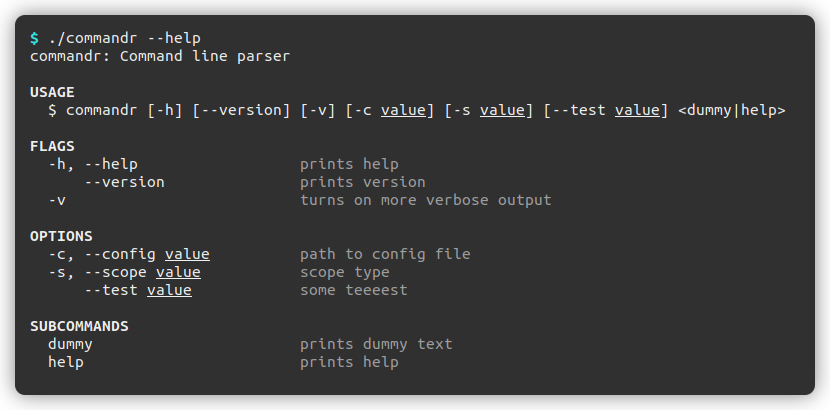

<!-- LOGO -->
<p align="center">
  <a href="https://github.com/robik/commandr">
    
  </a>

  <h2 align="center">commandr</h2>

  <p align="center">
    A modern, powerful commmand line argument parser. 
    <br>
    Batteries included.
    <br />
    <br />
    <a href="https://robik.github.io/commandr/"><strong>📗 Explore the docs »</strong></a>
    <br />
    <a href="https://github.com/robik/commandr/issues">❗️ Report a bug</a>
    ·
    <a href="https://github.com/robik/commandr/issues">💡 Request feature</a>    
    <br />  
    <br />
    
    
    
    
    
    <br />
  </p>
</p>

- - -

**commandr** handles all kinds of command-line arguments with a nice and clean interface.<br/>
Comes with help generation, shell auto-complete scripts and validation. 


## Table of Contents

 - [Preview](#preview)
 - [Installation](#installation)
 - [FAQ](#faq)
 - [Features](#features)
 - [Getting Started](#getting-started)
   - [Basic usage](#basic-usage)
   - [Subcommands](#subcommands)
   - [Validation](#validation)
   - [Printing help](#printing-help)
   - [Bash autocompletion](#bash-autocompletion)
   - [Configuration](#configuration)
 - [Cheat-Sheet](#cheat-sheet)
   - [Defining Entries](#defining-entries)
   - [Reading Values](#reading-values)
   - [Property Matrix](#property-matrix)
 - [Roadmap](#roadmap)
 - [License](#license)


## Preview

<p align="center">

</p>

## Installation

Add this entry to your `dub.json` file:

```json
  "dependencies": {
    ...
    "commandr": "~>0.1"
    ...
  }
```

## FAQ

 - **Does it use templates/compile-time magic?**
   
   No, at least currently not. Right now everything is done at runtime, so there's not much overhead on compilation time resources.
   In the future I'll probably look into generation of compile-time struct.

   The reason is that I want it to be rather simple and easy to learn, and having a lot of generated code hurts e.g. generated documentation
   and some minor things such as IDE auto-complete (even right now mixin-s cause some problems).

 - **Are the results typesafe? / Does it use UDA?**

   No, parsed arguments are returned in a `ProgramArgs` class instance that allow to fetch parsed data,

   However it should be possible to generate program definition from struct/class with UDA and then 
   fill the parsed data into struct instance, but it is currently out of scope of this project (at least for now).


## Features

 - **Flags** (boolean values)
   - Short and long forms are supported (`-v`, `--verbose`)
   - Supports stacking of flags (`-vvv` is same as `-v -v -v`)

 - **Options** (taking a string value)
   - Short and long forms are supported (`-c test`, `--config test`)
   - Equals sign accepted (`-c=1`, `--config=test`)
   - Repeated options are supported (`-c 1 -c 2`)
   - Default values can be specified.
   - Options be marked as required.

 - **Arguments** (positional)
   - Required by default, can be marked as optional
   - Default values can be specified.
   - Repeated options are supported (only last argument)

 - **Commands** (git-style)
   - Infinitely recursive subcommands (you can go as deep as needed)
   - Contains own set of flags/options and arguments
   - Dedicated help output
   - Comfortable command handling with `ProgramArgs.on()`

 - **Provided help output**
   - Generated help output for your program and sub-commands
   - Can be configured to suit your needs, such as disabling colored output.
   - Provided usage, help and version information.
   - Completly detached from core `Program`, giving you complete freedom in writing your own help output.
   - You can categorize commands for better help output

 - **Consistency checking**
   - When you build your program model, `commandr` checks its consistency.
   - Detects name duplications as well as short/long options.
   - Detects required parameters with default value.

 - **BASH auto-complete script**
   - You can generate completion script with single function call
   - Completion script works on flags, options and sub-commands (at any depth)
   - Acknowledges difference between flags and options

 - **Validators**
   - Passed values can be checked for correctness
   - Simple process of creating custom validating logic
   - Provided validators for common cases: `EnumValidator`, `FileSystemValidator` and `DelegateValidator`

 - **Suggestions**
   - Suggestion with correct flag, option or sub-command name is provided when user passes invalid value
   - Also supported for `EnumValidator` (`acceptsValues`)


## Getting Started

### Basic Usage

Simple example showing how to create a basic program and parse arguments:

```D
import std.stdio;
import commandr;

void main(string[] args) {
    auto a = new Program("test", "1.0")
          .summary("Command line parser")
          .author("John Doe <me@foo.bar.com>")
          .add(new Flag("v", null, "turns on more verbose output")
              .name("verbose")
              .repeating)
          .add(new Option(null, "test", "some teeeest"))
          .add(new Argument("path", "Path to file to edit"))
          .parse(args);

      writeln("verbosity level", a.occurencesOf("verbose"));
      writeln("arg: ", a.arg("path"));
}
```

### Subcommands

You can create subcommands in your program or command using `.add`. You can nest commands.

Adding subcommands adds a virtual required argument at the end to your program. This makes you unable to declare repeating or optional arguments (because you cannot have required argument past these).

Default command can be set with `.defaultCommand(name)` call after defining all commands.

After parsing, every subcommand gets its own `ProgramArgs` instance, forming a hierarchy. Nested args inherit arguments from parent, so that options defined higher
in hierarchy are copied.
ProgramArgs defines a helper method `on`, that allows to dispatch method on specified command.

```D
auto args = new Program("test", "1.0")
      .add(new Flag("v", null, "turns on more verbose output")
          .name("verbose")
          .repeating)
      .add(new Command("greet")
          .add(new Argument("name", "name of person to greet")))
      .add(new Command("farewell")
          .add(new Argument("name", "name of person to say farewell")))
      .parse(args);

args
  .on("greet", (args) {
    // args.flag("verbose") works
    writefln("Hello %s!", args.arg("name"));
  })
  .on("farewell", (args) {
    writefln("Bye %s!", args.arg("name"));
  });
```

Delegate passed to `on` function receives `ProgramArgs` instance for that subcommand. Because it is also `ProgramArgs`, `on` chain can be nested, as in:

```D
// assuming program has nested subcommands

a.on("branch", (args) {
  args
    .on("add", (args) {
      writefln("adding branch %s", args.arg("name"));
    })
    .on("rm", (args) {
      writefln("removing branch %s", args.arg("name"));
    });
});
```

### Validation

You can attach one or more validators to options and arguments with `validate` method. Every validator has its own helper function that simplifies adding it do option (usually starting with `accepts`):

```D
new Program("test")
  // adding validator manually
  .add(new Option("s", "scope", "")
      .validate(new EnumValidator(["local", "global", "system"]))
  )
  // helper functionnew Program("test")
  .add(new Option("s", "scope", "")
      .acceptsValues(["local", "global", "system"]));
```

#### Built-in validators

 - **EnumValidator** - Allows to pass values from white-list.

   Helpers: `.acceptsValues(values)`

 - **FileSystemValidator** - Verifies whenever passed values are files/directories or just exist (depending on configuration).

   Helpers: `.acceptsFiles()`, `.acceptsDirectories()`, `.acceptsPaths(bool existing)`

 - **DelegateValidator** - Verifies whenever passed values with user-defined delegate.

   Helpers: `.validateWith(delegate)`, `validateEachWith(delegate)`


You can create custom validators either by implementing `IValidator` interface, or by using `DelegateValidator`:

```D
new Program("test")
  // adding validator manually
  .add(new Option("s", "scope", "")
      .validateEachWith(opt => opt.isDirectory), "must be a valid directory");
```


### Printing help

You can print help for program or any subcommand with `printHelp()` function:

```D
program.printHelp(); // prints program help
program.commands["test"].printHelp();
```

To customise help output, pass `HelpOutput` struct instance:

```D
HelpOutput helpOptions;
helpOptions.colors = false;
helpOptions.optionsLimit = 2;

program.printHelp(helpOptions);
```

### Bash autocompletion

Commandr can generate BASH autocompletion script. During installation of your program you can save the generated script to `/etc/bash_completion.d/<programname>.bash` (or any other path depending on distro).

```D
import commandr;
import commandr.completion.bash;

string script = program.createBashCompletionScript();
// save script to file
```

### Configuration

TODO


## Cheat-Sheet

### Defining entries

Overview of available entries that can be added to program or command with `.add` method:

What         | Type     | Example     | Definition                            
-------------|----------|-------------|---------------------------------------
**Flag**     | bool     | `--verbose` | `new Flag(abbrev?, full?, summary?)`  
**Option**   | string[] | `--db=test` | `new Option(abbrev?, full?, summary?)`
**Argument** | string[] | `123`       | `new Argument(name, summary?)`        


### Reading values

Shows how to access values after parsing args.

Examples assume `args` variable contains result of `parse()` or `parseArgs()` function calls (an instance of `ProgramArgs`)

```D
ProgramArgs args = program.parse(args);
```

What         | Type     | Fetch
-------------|----------|--------------------
**Flag**     | bool     | `args.flag(name)`
**Flag**     | int      | `args.occurencesOf(name)`
**Option**   | string   | `args.option(name)`
**Option**   | string[] | `args.options(name)`
**Argument** | string   | `args.arg(name)`
**Argument** | string[] | `args.args(name)`


### Property Matrix

<!-- :heavy_check_mark: ❌ -->

Table below shows which fields exist and which don't (or should not be used).

Column `name` contains name of the method to set the value. All methods return
`this` to allow chaining.

Name                 | Program | Command | Flag | Option | Argument
---------------------|---------|---------|------|--------|---------
`.name`              | :heavy_check_mark:      | :heavy_check_mark:      | :heavy_check_mark:   | :heavy_check_mark:     | :heavy_check_mark:
`.version_`          | :heavy_check_mark:      | :heavy_check_mark:      | ❌   | ️❌     | ❌
`.summary`           | :heavy_check_mark:️      | ️:heavy_check_mark:      | ❌   | ️❌     | ❌
`.description`       | ❌      | ️❌      | :heavy_check_mark:   | ️:heavy_check_mark:     | :heavy_check_mark:
`.abbrev`            | ❌      | ❌      | :heavy_check_mark:   | :heavy_check_mark:     | ❌
`.full`              | ❌      | ❌      | :heavy_check_mark:️   | ️:heavy_check_mark:     | ❌
`.tag`               | ❌      | ❌      | ❌   | ️:heavy_check_mark:     | :heavy_check_mark:️
`.defaultValue`      | ❌      | ❌      | ❌   | ️:heavy_check_mark:     | :heavy_check_mark:️
`.required`          | ❌      | ❌      | ❌   | ️:heavy_check_mark:     | :heavy_check_mark:️
`.optional`          | ❌      | ❌      | ❌   | ️:heavy_check_mark:     | :heavy_check_mark:️
`.repeating`         | ❌      | ❌      | :heavy_check_mark:   | ️:heavy_check_mark:     | :heavy_check_mark:️
`.topic`             | ❌      | :heavy_check_mark:      | ❌   | ️❌     | ❌
`.topicGroup`        | :heavy_check_mark:      | :heavy_check_mark:      | ❌   | ️❌     | ❌
`.authors`           | :heavy_check_mark:      | ❌      | ❌   | ️❌     | ❌
`.binaryName`        | :heavy_check_mark:      | ❌      | ❌   | ️❌     | ❌


## Roadmap

Current major missing features are:

 - Command/Option aliases
 - Combined short flags/options (e.g. `-qLob`)
 - EnumValidator/FileSystemValidator auto-completion hinting

See the [open issues](https://github.com/robik/commandr/issues) for a list of proposed features (and known issues).